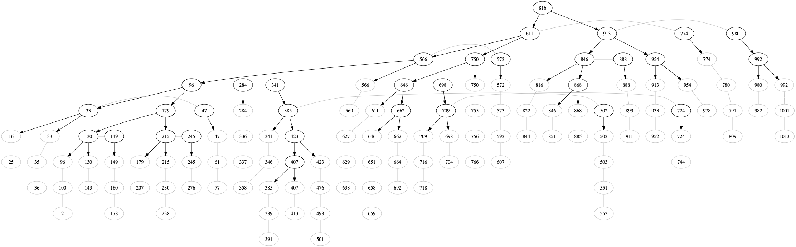

# Playground

Immutable B+Tree written in scala.

```bash
sbt run
```

A random tree is generated and converted into a dot file `/tmp/tree.dot`.

Visualizing the output:

```bash
dot -Tpng /tmp/tree.dot > /tmp/tree.png && open /tmp/tree.png
```


